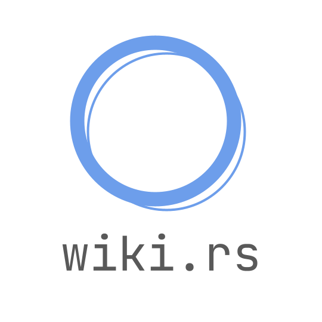
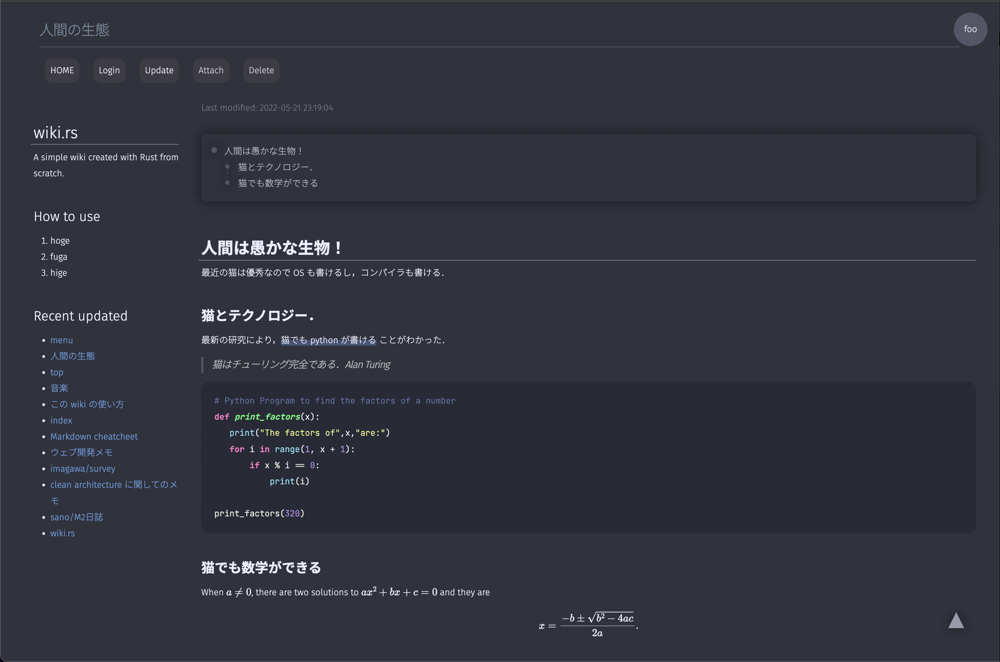

<div id="top"></div>
<!--
*** Thanks for checking out the Best-README-Template. If you have a suggestion
*** that would make this better, please fork the repo and create a pull request
*** or simply open an issue with the tag "enhancement".
*** Don't forget to give the project a star!
*** Thanks again! Now go create something AMAZING! :D
-->

<!-- PROJECT SHIELDS -->
<!--
*** I'm using markdown "reference style" links for readability.
*** Reference links are enclosed in brackets [ ] instead of parentheses ( ).
*** See the bottom of this document for the declaration of the reference variables
*** for contributors-url, forks-url, etc. This is an optional, concise syntax you may use.
*** https://www.markdownguide.org/basic-syntax/#reference-style-links
-->

[![Contributors][contributors-shield]][contributors-url]
[![Forks][forks-shield]][forks-url]
[![Stargazers][stars-shield]][stars-url]
[![Issues][issues-shield]][issues-url]
[![MIT License][license-shield]][license-url]

<!-- PROJECT LOGO -->
<br />
<div align="center">
  <a href="https://github.com/sano-jin/wiki-rs">
    
  </a>

<h3 align="center">wiki.rs</h3>

  <p align="center">
    A simple wiki created with rust
    <br />
    <a href="docs/README.md"><strong>Explore the docs »</strong></a>
    <br />
    <br />
    <a href="https://github.com/sano-jin/wiki-rs">View Demo</a>
    ·
    <a href="https://github.com/sano-jin/wiki-rs/issues">Report Bug</a>
    ·
    <a href="https://github.com/sano-jin/wiki-rs/issues">Request Feature</a>
  </p>
</div>

<!-- TABLE OF CONTENTS -->
<details>
  <summary>Table of Contents</summary>
  <ol>
    <li>
      <a href="#about-the-project">About The Project</a>
      <ul>
        <li><a href="#built-with">Built With</a></li>
      </ul>
    </li>
    <li>
      <a href="#getting-started">Getting Started</a>
      <ul>
        <li><a href="#prerequisites">Prerequisites</a></li>
        <li><a href="#installation">Installation</a></li>
      </ul>
    </li>
    <li><a href="#usage">Usage</a></li>
    <li><a href="#roadmap">Roadmap</a></li>
    <li><a href="#contributing">Contributing</a></li>
    <li><a href="#license">License</a></li>
    <li><a href="#contact">Contact</a></li>
    <li><a href="#acknowledgments">Acknowledgments</a></li>
  </ol>
</details>

<!-- ABOUT THE PROJECT -->

## About The Project

[](https://github.com/sano-jin/wiki-rs)

- レスポンシブ対応
- ダークモード対応
- 数式対応（`\(\)` で inline equation, `\[\]` で block）
- ソースコードのシンタックスハイライトが可能
- ソースコードのコピーができるボタンあり
- データベース不要で，rust 環境さえあればすぐに導入可能
  （DB は後から導入するかも知れない．要検討）
- コメントアウト対応（`//` でコメントアウトする）

<p align="right">(<a href="#top">back to top</a>)</p>

### Built With

- [Next.js](https://nextjs.org/)
- [React.js](https://reactjs.org/)
- [Vue.js](https://vuejs.org/)
- [Angular](https://angular.io/)
- [Svelte](https://svelte.dev/)
- [Laravel](https://laravel.com)
- [Bootstrap](https://getbootstrap.com)
- [JQuery](https://jquery.com)

<p align="right">(<a href="#top">back to top</a>)</p>

<!-- GETTING STARTED -->

## Getting Started

This is an example of how you may give instructions on setting up your project locally.
To get a local copy up and running follow these simple example steps.

### Prerequisites

- Cargo/rust
  - See <https://www.rust-lang.org/tools/install>

### Installation

1. TLS/SSL の証明書を発行し，`cert.pem`, `key.pem` という名前にして，
   プロジェクトのルートディレクトリに置く．
   TLS/SSL を有効にしないなら不要．

2. サンプルの db が docs 以下にあるので，それを持ってくる．

   ```sh
   cp -r docs/db .
   ```

3. 初期ユーザを追加する．
   ユーザ名が `foo`，パスワードが `bar` のユーザを追加したい場合は，
   `db/users` directory に
   ファイル名が `foo` で，以下のような JSON が書かれたファイルを配置する．

   ```json
   { "name": "foo", "password": "bar" }
   ```

   つまり，

   ```sh
   mkdir db/users
   echo '{"name":"foo","password":"bar"}' > db/users/foo
   ```

   を実行すれば良い．

4. `.env.template` を参考に，`.env` を生成する

   - 追記：これは現時点では不要

5. cargo で backend を実行する

   ```sh
   cargo run
   ```

   TLS/SSL を有効にしないなら，

   ```sh
   cargo run unsecure
   ```

   を実行する

   - 補足：cargo watch を install して，`cargo watch -x run` とすると，
     ソースコードを変更して保存するごとに，コンパイルして実行し直してくれるので便利です．

6. and access <https://127.0.0.1:8443/> on your browser.
   もし TLS/SSL を有効にしてなかったら，access <http://0.0.0.0:8080/> on your browser.

<p align="right">(<a href="#top">back to top</a>)</p>

<!-- USAGE EXAMPLES -->

## Usage

Use this space to show useful examples of how a project can be used. Additional screenshots, code examples and demos work well in this space. You may also link to more resources.

_For more examples, please refer to the [Documentation](https://example.com)_

<p align="right">(<a href="#top">back to top</a>)</p>

<!-- ROADMAP -->

## Roadmap

- [ ] Feature 1
- [ ] Feature 2
- [ ] Feature 3
  - [ ] Nested Feature

See the [open issues](https://github.com/sano-jin/wiki-rs/issues) for a full list of proposed features (and known issues).

<p align="right">(<a href="#top">back to top</a>)</p>

<!-- CONTRIBUTING -->

## Contributing

Contributions are what make the open source community such an amazing place to learn, inspire, and create. Any contributions you make are **greatly appreciated**.

If you have a suggestion that would make this better, please fork the repo and create a pull request. You can also simply open an issue with the tag "enhancement".
Don't forget to give the project a star! Thanks again!

1. Fork the Project
2. Create your Feature Branch (`git checkout -b feature/AmazingFeature`)
3. Commit your Changes (`git commit -m 'Add some AmazingFeature'`)
4. Push to the Branch (`git push origin feature/AmazingFeature`)
5. Open a Pull Request

<p align="right">(<a href="#top">back to top</a>)</p>

<!-- LICENSE -->

## License

Distributed under the MIT License. See `LICENSE.txt` for more information.

<p align="right">(<a href="#top">back to top</a>)</p>

<!-- CONTACT -->

## Contact

Your Name - [@sano65747676](https://twitter.com/sano65747676)

Project Link: [https://github.com/sano-jin/wiki-rs](https://github.com/sano-jin/wiki-rs)

<p align="right">(<a href="#top">back to top</a>)</p>

<!-- ACKNOWLEDGMENTS -->

## Acknowledgments

- []()
- []()
- []()

<p align="right">(<a href="#top">back to top</a>)</p>

<!-- MARKDOWN LINKS & IMAGES -->
<!-- https://www.markdownguide.org/basic-syntax/#reference-style-links -->

[contributors-shield]: https://img.shields.io/github/contributors/sano-jin/wiki-rs.svg?style=for-the-badge
[contributors-url]: https://github.com/sano-jin/wiki-rs/graphs/contributors
[forks-shield]: https://img.shields.io/github/forks/sano-jin/wiki-rs.svg?style=for-the-badge
[forks-url]: https://github.com/sano-jin/wiki-rs/network/members
[stars-shield]: https://img.shields.io/github/stars/sano-jin/wiki-rs.svg?style=for-the-badge
[stars-url]: https://github.com/sano-jin/wiki-rs/stargazers
[issues-shield]: https://img.shields.io/github/issues/sano-jin/wiki-rs.svg?style=for-the-badge
[issues-url]: https://github.com/sano-jin/wiki-rs/issues
[license-shield]: https://img.shields.io/github/license/sano-jin/wiki-rs.svg?style=for-the-badge
[license-url]: https://github.com/sano-jin/wiki-rs/blob/master/LICENSE.txt
[product-screenshot]: images/screenshot.png
