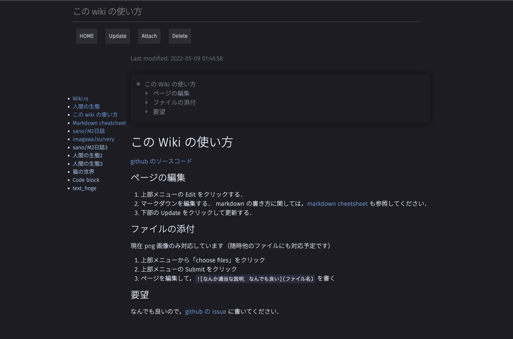

wiki.rs

A simple wiki created with Rust from scratch.


# 特徴

- レスポンシブ対応
- ダークモード対応
- 数式対応（`\(\)` で inline equation, `\[\]` で block）
- ソースコードのシンタックスハイライトが可能
- ソースコードのコピーができるボタンあり
- データベース不要で，rust 環境さえあればすぐに導入可能
  （DB は後から導入するかも知れない．要検討）
- コメントアウト対応（`//` でコメントアウトする）

これから対応予定のもの

- ユーザごとのプライベートなページ
- github, youtube などの外部サイトとの連携
  - ソースコードや動画の埋め込み表示

# Development

## Prerequisties

Install Cargo

## Run

1. サンプルの public directory が docs 以下にあるので，それを持ってくる．

   ```sh
   cp -r docs/public .
   ```

2. cargo で backend を実行する

   ```sh
   cargo run
   ```

3. and access <https://127.0.0.1:8443/> on your browser.

# Design

とりあえずの architecture:

- model
  - page の型宣言をしておく
  - markdown から page に変換したりするコードを置いておく
- interface adapters :: controllers, presenters, gateways
  - ページの更新や取得などを行うコードを書いておく
- frameworks and drivers :: web, ui, external interfaces, devices, db

clean architecture:

- Enterprise business rules :: entities
  - page の型宣言をしておく
- application business rules :: use cases, interactor
  - markdown から page に変換したりするコードを置いておく
- interface adapters :: controllers, presenters, gateways
  - ページの更新や取得などを行うコードを書いておく
- frameworks and drivers :: web, ui, external interfaces, devices, db

# API design

## Front

- 普通にアクセスして見る．
- 今見ているページの markdown を編集して，それでページを更新する．
  - edit button
- 新しいページの markdown を編集して，それでページを更新する．
  - create button

## Backend API

- GET `/page?path=<Path to the page>`
  - `<Path to the page>` にある html ページを返す
  - サーバ上のファイルから読み込む
- GET `/edit?path=<Path to the page>`
  - 編集用の markdown を返す
  - サーバ上のファイルから読み込む
- POST `/edit {path:"<Path to the page>", body: "<The updated markdown>"}`
  - markdown を投げ，それで `<Path to the page>` を更新する
  - そのページがもともと存在しない場合は新しく作る．
  - サーバ上のファイルに書き出しておく
- DELETE `/edit?path=<Path to the page>`
  - `<Path to the page>` を消去する
  - サーバ上のファイルは消去する

## 構成

### client-side

```sh
public/
├── assets/ # some assets files
│   ├── dracula.css
│   └── main.css
├── edit/ # directory to save markdown files
├── index.html # the root index.html file
├── layouts/ # some template html files
│   ├── edit.html
│   └── page.html
└── pages/ # directory to save the transformed html files
```

### server-side

```sh
src
├── controllers
│   ├── handle_page.rs
│   ├── index.rs
│   └── mod.rs
├── lib.rs
├── main.rs
├── models
│   ├── mod.rs
│   └── pages.rs
├── routes.rs
└── util.rs
```

## TODOs

- [ ] clean architecture などをもとにアーキテクチャを再考する．
- [ ] issue に挙げたものの解決

# Demo



